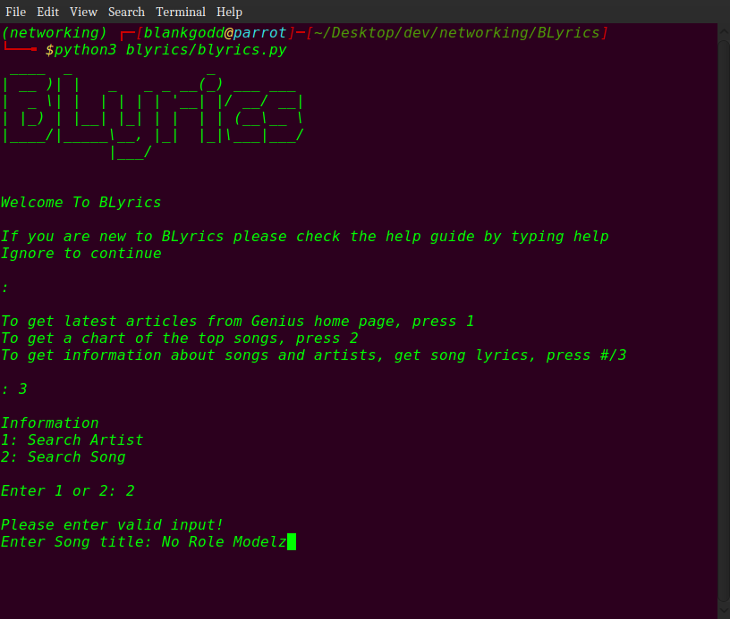

# BLyrics :notes: 

A CLI tool for interacting with Genius

Leveraging the Genius api with python

Use on Telegram
****
[t.me/blyrics_bot](https://t.me/blyrics_bot)

## Screeenshots
 


## API features include
1. Getting infomation :ok_hand:
   - Songs :sound:
   - Artists :sunglasses:
   - Lyrics :memo:
   - Annotations :pen:

2. Saving prefrences :zap:
   - Artist Info :sunglasses:
   - Song info and lyrics :memo:
   
3. Latest information and articles :dizzy:
   - Headliner from genius.com
   - Oher articles
   - Charts

## Requirements
1. Python3 
2. Any Operating system
3. [Requirements](requirements.txt)
4. An open mind

## Usage
### As Module
1. Read [Documentation](https://pypi.org/project/blyrics/)

2. [Setup virtual enviroment](https://realpython.com/python-virtual-environments-a-primer/)

3. Install from pypi
```sh
$ pip3 install blyrics
```
4. import module
```py
>>>from blyrics import Package
>>>Package = Package()
>>># Get song info and lyrics
>>>song_info = Package.search_song(song='No role Models')
>>>
>>># Get artist information
>>>artist_info = Package.search_artist(artist='Cole')
```

### As script
1. Clone the repository
```sh
$ git clone https://github.com/AgbaD/BLyrics.git

$ cd BLyrics
```
2. [Setup virtual enviroment](https://realpython.com/python-virtual-environments-a-primer/)

3. Install the dependencies
```sh
$ pip3 install -r requirements.txt
```
4. Run script
   - Windows OS
     ```sh
     $ python blyrics\blyrics.py
     ```
   - Unix or Linux
     ```sh
     $ python3 blyrics/blyrics.py
     ```

## Note
- kindly share with friends :smiley:
- Thank you for using :smile:
- If there is any problem, you can open an issue :grey_question:
- Leave us a star :star:

## Contributor(s)
**@BlankGodd**


